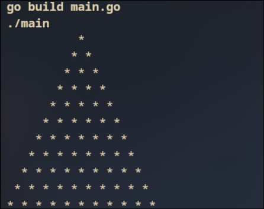
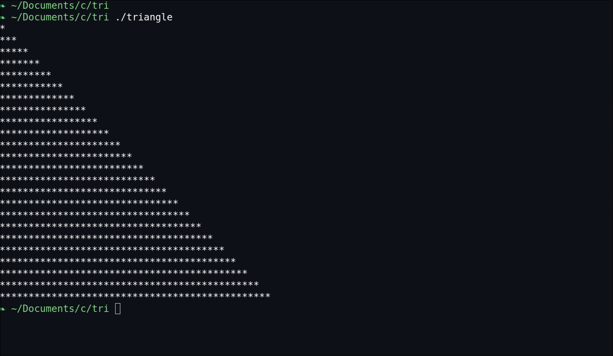
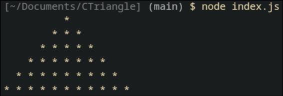

<h1 align="center"> CTriangle </h1>
<h3 align="center"> Print Triangle on the terminal </h3>


<p align="center">
  
  
  
</p>

# Introduction
The `CTriangle` is my personal repository containing logics and it's original hand-written code to print ASCII triangle in different programming languages that I ever learned.


|Languages| Personal Difficulty | Ratings 🌟 |
|:---| :---:| ---: |
| Javascript | asynchronous code and confusing reference types| 6/10 |
| C | Unreadable Compiler Errors | 9.5/10|
| Go |  Manual error handlings and return types | 7/10|


# Installation
To install, simply clone the repository onto your local machine then test the files seperately with compilers or interpreter for different languages
```sh
git clone https://github.com/waxodium/CTriangle.git
```

#### justfile options:
```sh
just go # golang
just c # c23
just js # nodejs
just clean # cleanup
```

# Features
There's no features but just print a triangle 📐 

# License
This program is outlined by [MIT Open Source License](https://github.com/waxodium/CTriangle/blob/main/LICENSE).

